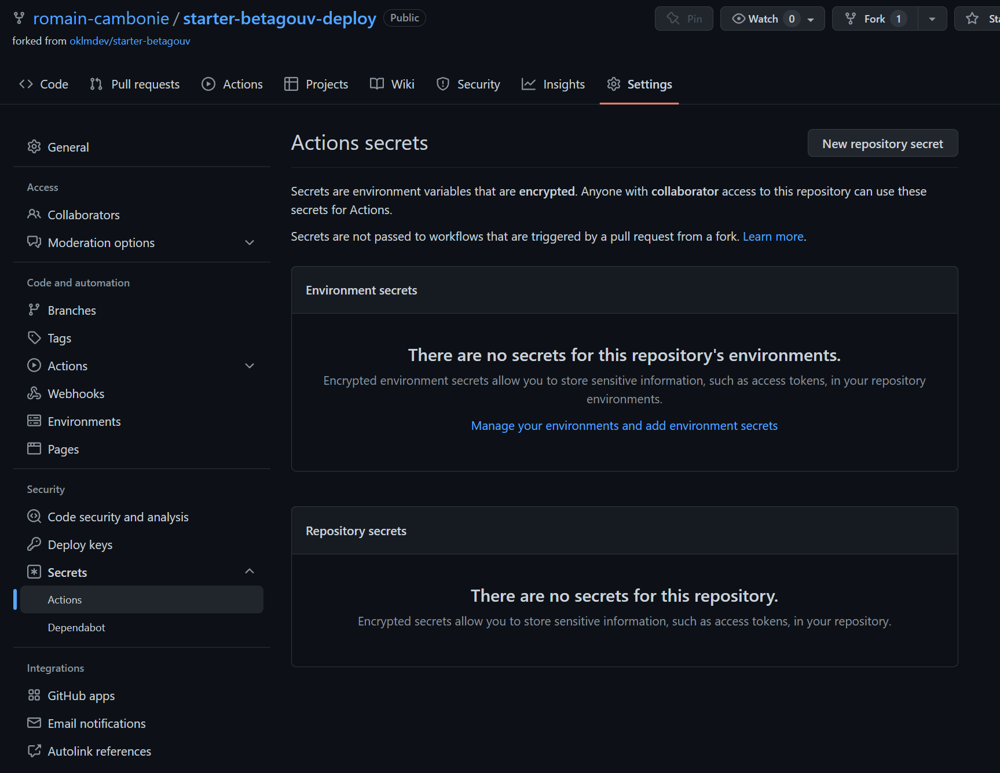
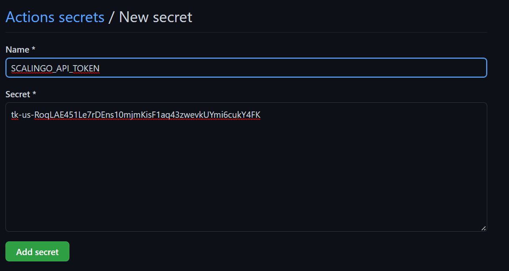
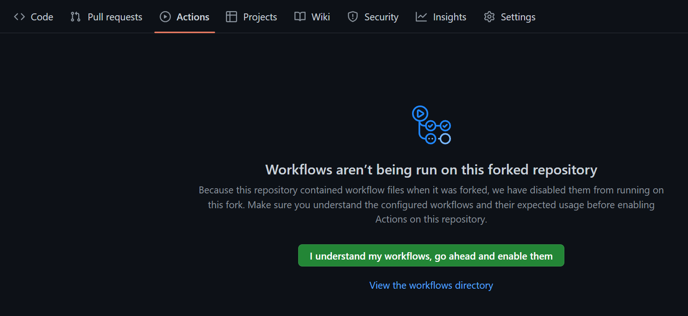

# A propos
Dans sa version la plus simple il n'y a qu'un seul environment de production deployé sur [Scalingo](https://scalingo.com/fr)
Scalingo est un [PaaS](https://scalingo.com/fr/blog/paas-guide-complet) souverain français qui satisfais bien les exigences de BetaGouv.

# Déployer ma copie du starter en moins d'une heure.

## Prérequis
- Avoir dépot git pour le projet sur [github](https://github.com/) et être connecté sur votre compte.

## 1. Forker (créer une copie) du dépot
- Allez sur [https://github.com/oklmdev/starter-betagouv](https://github.com/oklmdev/starter-betagouv) et cliquez sur le bouton 'Fork' en haut à droite 

- Acceptez la création du fork sur mon dépot.

# 2. Créer un compte sur scalingo 
- Allez sur la [page d'inscription scalingo](https://auth.scalingo.com/users/sign_up) et créez votre compte (pas besoin de mettre de moyen de paiement pour l'instant :) )

# 3. Créer un token api sur scalingo.
- Allez sur [vos paramètres de compte, section 'Tokens Api'](https://dashboard.scalingo.com/account/tokens) et cliquez sur 'Ajouter'.
- Donner un nom à votre token api puis copiez-collez sa valeur pour pouvoir la retrouver ensuite 
  - Attention ne la partagez avec personne ! Ce token ne sera plus visible ensuite et permet un accès complet à votre compte Scalingo.

# 4. Renseigner le token api dans les secrets github
- Allez dans les 'Settings' du dépot de votre projet qui contient le fork du starter. (url_du_dépot/settings)
- Sélectionnez la catégorie 'Secrets' puis 'actions' dans le menu de gauche
  

- Créez un 'New Repository Secret' avec
  - pour nom 'SCALINGO_API_TOKEN'
  - pour valeur le token api scalingo copié précédement.
- Validez en cliquant sur 'Add Secret'

# 5. Lancer l'action de déploiement
- Allez dans les 'Actions' du dépot de votre projet (url_du_dépot/actions)
- Validez l'activation des actions en cliquant sur 'I understand my workflows, go ahead and enable them'
- 

- Cliquez sur 'Déployer sur Scalingo' dans la liste des Workflows 
  - puis cliquez sur le bouton  'Run workflow'
  - puis encore sur la confirmation Run workflow avec l'option 'Use workflow from' active sur 'master'

